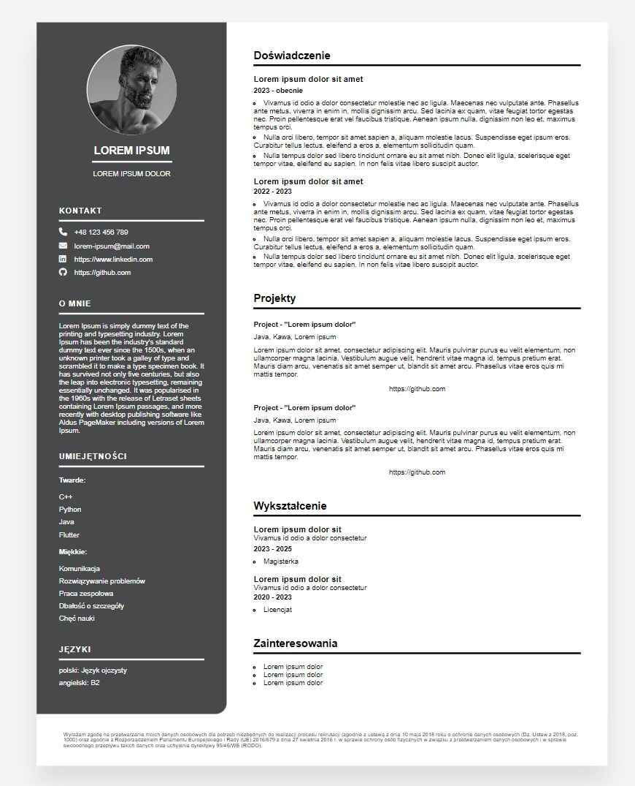

<h1 align="center">
    <b>Web Development</b> 
</h1>

## :clipboard: **Spis treści**

- [**Co znajduje się w tym repo?**](#co-znajduje-się-w-tym-repo)
- [**Projekty**](#projekty)
  - [📄 **Projekt 1 - CV**](#-projekt-1---cv)
    - [**Opis zadania**](#opis-zadania)
    - [**Realizacja zadania**](#realizacja-zadania)
- [📚 **Materiały do nauki, z których korzystałem**](#-materiały-do-nauki-z-których-korzystałem)

---

# **Co znajduje się w tym repo?**

> Wszelkie materiały powiązane z wykonaniem z przedmiotem "Web Development"

---

# **Projekty**

## 📄 **Projekt 1 - CV**

### **Opis zadania**

Stworzyć CV z wykorzystaniem HTML5 i CSS. Strona powinna przechodzić walidację W3C bezbłędnie.

Szczegóły dotyczące projektu znajdują się w plikach:

-   [lab_1](lab_1/materialy/)

### **Realizacja zadania**

Zrealizowany projekt znajduje się [tutaj](projekty/cv/).

---

# 📚 **Materiały do nauki, z których korzystałem**

Znajdują się [tutaj](materialy/materialy.md).
