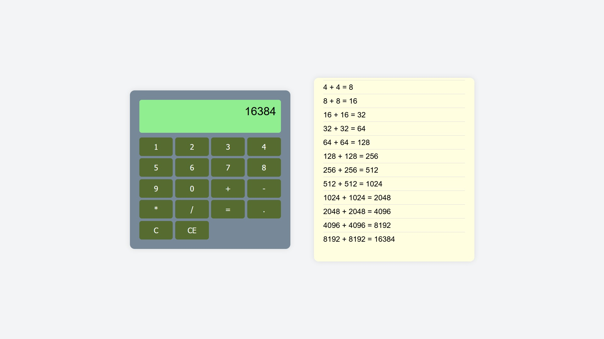
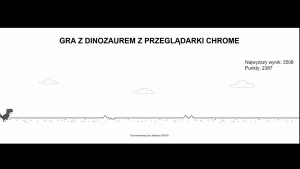

<h1 align="center">
    <b>Web Development</b> 
</h1>

## :clipboard: **Spis treści**

- [**Co znajduje się w tym repo?**](#co-znajduje-się-w-tym-repo)
- [**Zadania**](#zadania)
- [**Projekty**](#projekty)
  - [📄 **Projekt - CV**](#-projekt---cv)
    - [**Opis zadania**](#opis-zadania)
    - [**Realizacja zadania**](#realizacja-zadania)
  - [🔢 **Projekt - Kalkulator**](#-projekt---kalkulator)
    - [**Opis zadania**](#opis-zadania-1)
    - [**Realizacja zadania**](#realizacja-zadania-1)
  - [🎮 **Projekt - Gra z wykorzystaniem Canvas**](#-projekt---gra-z-wykorzystaniem-canvas)
    - [**Opis zadania**](#opis-zadania-2)
    - [**Realizacja zadania**](#realizacja-zadania-2)
- [📚 **Materiały do nauki, z których korzystałem**](#-materiały-do-nauki-z-których-korzystałem)

---

# **Co znajduje się w tym repo?**

> Wszelkie materiały powiązane z wykonaniem z przedmiotem "Web Development"

---

# **Zadania**

W folderze [zadania](zadania/) znajdują się rozwiązania zadań z laboratoriów. Wykorzystywane były między innymi takie technologie, jak: **NodeJS**, **Express.js**, **Swagger**, **Postman**, **Bootstrap**, **Moongoose**, oraz baza danych NoSQL **MongoDB**.

---

# **Projekty**

## 📄 **Projekt - CV**

### **Opis zadania**

Stworzyć CV z wykorzystaniem HTML5 i CSS. Strona powinna przechodzić walidację W3C bezbłędnie.

Szczegóły dotyczące projektu znajdują się w plikach:

-   [lab_1](lab_1/)

### **Realizacja zadania**

Zrealizowany projekt znajduje się [tutaj](projekty/cv/).

---

## 🔢 **Projekt - Kalkulator**

### **Opis zadania**

Korzystając z faktu, że na poziomie interpretera ES przeglądarki za pomocą metod obiektu document możliwe jest budowanie struktury DOM stwórz aplikację kalkulatora w oparciu o załączoną postać startową.

Szczegóły dotyczące projektu znajdują się w plikach:

-   [lab_1](lab_1/)

### **Realizacja zadania**

Zrealizowany projekt znajduje się [tutaj](projekty/calculator/).

---

## 🎮 **Projekt - Gra z wykorzystaniem Canvas**

### **Opis zadania**

Stworzyć grę z wykorzystaniem HTML, CSS oraz JavaScript. Gra powinna wykorzystywać Canvas.

Szczegóły dotyczące tego projektu znajdują się w plikach:

-   [lab_3](lab_3/)

### **Realizacja zadania**

Zrealizowany projekt znajduje się [tutaj](projekty/game/).

---

# 📚 **Materiały do nauki, z których korzystałem**

Znajdują się [tutaj](materialy/materialy.md).
